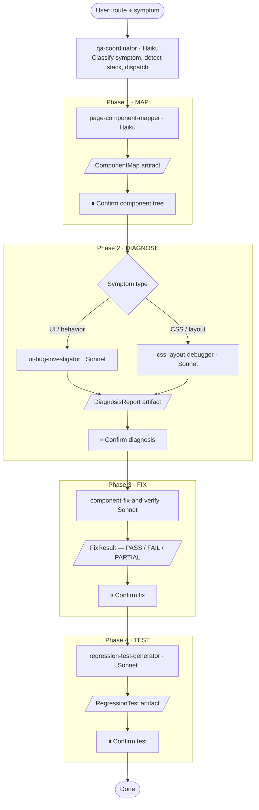

# Frontend QA Skills

A suite of Claude Code skills for component-level frontend QA in Next.js App Router / TypeScript projects. Describe a bug naturally and the pipeline maps the component tree, diagnoses the root cause, applies a fix with verification, and generates a regression test. Every phase pauses for your confirmation before proceeding.

## Quick Start

**Prerequisites:** [Claude Code](https://docs.anthropic.com/en/docs/claude-code) CLI installed, a Next.js project.

```bash
# 1. Clone the skill suite
git clone https://github.com/dtsong/frontend-qa-skills.git

# 2. Install globally — works with every Next.js project
./frontend-qa-skills/install.sh --global

# 3. Start Claude Code in any Next.js project
cd /path/to/your-nextjs-app && claude
# then type: /qa

# Alternative: install into one specific project only
# ./frontend-qa-skills/install.sh /path/to/your-nextjs-app
```

## Slash Commands

| Command | Description |
|---------|-------------|
| `/qa` | Full pipeline -- describe the bug, the coordinator handles the rest |
| `/map` | Map a route's component tree (mapper only) |
| `/diagnose` | Diagnose a bug against an existing component map |
| `/fix` | Apply and verify a fix from an existing diagnosis |

## What It Looks Like

Here's a condensed walkthrough of a `/qa` session for a sidebar-overlap bug:

**You:** "The sidebar overlaps the main content on mobile viewports on the /dashboard page"

**Phase 1 -- Map.** The coordinator traces `app/dashboard/page.tsx` imports and builds a component tree: `DashboardPage > Sidebar + MainContent > ...`. You confirm the tree looks correct.

**Phase 2 -- Diagnose.** The CSS layout debugger identifies that `Sidebar` uses `fixed left-0 w-[280px]` with no responsive breakpoint, while `MainContent` has a hard-coded `ml-[280px]`. You confirm the diagnosis.

**Phase 3 -- Fix & Verify.** A two-line fix adds `max-md:w-0 max-md:hidden` to the sidebar and `max-md:ml-0` to the main content. Verification runs TypeScript, lint, and related tests -- all pass. You approve.

**Phase 4 -- Test.** A regression test is generated that asserts the responsive collapse classes are present, annotated with what it guards against and what it doesn't. You approve the test.

## How It Works

Six skills form a pipeline, loaded one at a time (~4,100 tokens worst-case):

1. **qa-coordinator** -- classifies symptoms, auto-detects stack, dispatches to specialists
2. **page-component-mapper** -- traces route-to-component tree with boundary detection and caching
3. **ui-bug-investigator** -- diagnoses rendering, state, data flow, and event handling bugs
4. **css-layout-debugger** -- six-phase CSS diagnostic: token resolution, cascade, layout model, stacking, viewport
5. **component-fix-and-verify** -- applies fix with pre-flight baseline, scoped verification, and broad verification
6. **regression-test-generator** -- convention-aware test generation for Vitest+RTL, Jest+RTL, and Playwright



See [CATALOG.md](CATALOG.md) for trigger keywords, pipeline diagram, and sizing details.

## Installation Options

```bash
# Globally — recommended (available to all projects)
./install.sh --global

# Per-project (when you want project-scoped installation)
./install.sh /path/to/your-nextjs-app

# Role subsets — global or per-project
./install.sh --role diagnosis --global
./install.sh --role remediation --global
```

See [CATALOG.md](CATALOG.md) for role presets and global vs project comparison.

## Reference

- [CATALOG.md](CATALOG.md) -- full skill registry, pipeline diagram, sizing, version history
- [templates/](templates/) -- example output artifacts
- [install.sh](install.sh) -- installer with `--help` for all options

## License

[Apache 2.0](LICENSE)
